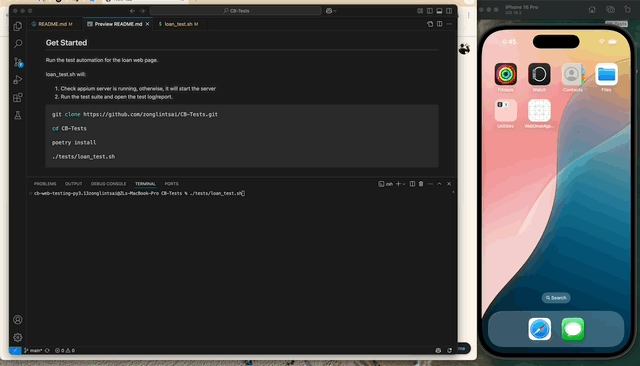

# iOS Web Automation

## Prerequisites

Make sure you have installed all the following dependencies:

### Appium

- **Homebrew**  
  Reference: https://brew.sh/
  ```sh
  /bin/bash -c "$(curl -fsSL https://raw.githubusercontent.com/Homebrew/install/HEAD/install.sh)"
  ```

- **Appium server**  
  ```sh
  brew install appium
  ```

- **Appium inspector (for development)**  
  Download the DMG from the [Appium Inspector Releases](https://github.com/appium/appium-inspector/releases) then install it

- **Appium iOS driver**  
  ```sh
  appium driver install xcuitest
  ```

### Xcode

- **Xcode**  
  Download from the App Store: [Xcode on App Store](https://apps.apple.com/tw/app/xcode/id497799835?l=en-GB&mt=12) then install it

- **Xcode Command Line Tools**  
  ```sh
  xcode-select --install
  ```

- **Simulator**  
  Xcode > Settings > Components > Add a desired simulator. This repo uses iPhone 16 Pro with iOS 18.3

### Python

- **Python 3.9+**
- **Poetry**  
  ```sh
  pip install poetry
  ```

## Get Started

Run the test automation for the loan web page.

loan_test.sh will:

1. Check appium server is running, otherwise, it will start the server
2. Run the test suite and open the test log/report.

```sh
git clone https://github.com/zonglintsai/CB-Tests.git

cd CB-Tests

poetry install

./tests/loan_test.sh
```

## Screenshot

Test results from the terminal


## Demo




## Reference

* [robotframework-appiumlibrary Documentation](https://serhatbolsu.github.io/robotframework-appiumlibrary/AppiumLibrary.html#library-documentation-top)
